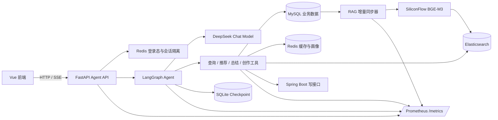
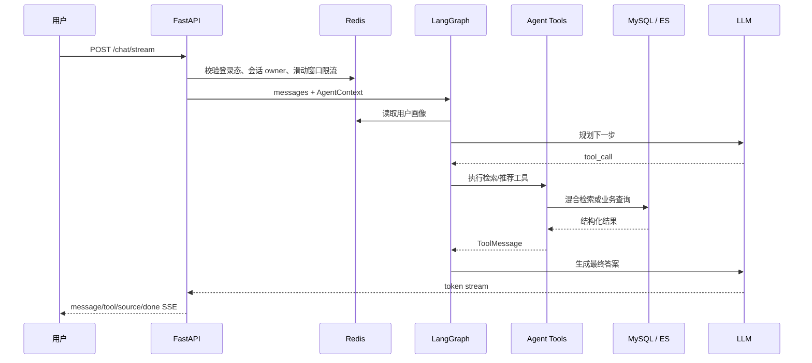

# ShineConnoisseur Agent 架构与关键链路

## 总体架构



## 一次对话的执行流程



## RAG 检索链路

1. 电影每日全量同步，影评每 5 分钟通过 `(update_time, id)` 复合游标增量同步。
2. 多实例通过 Redis 分布式锁避免重复推进游标。
3. 文本经 BGE-M3 生成向量，按文本摘要缓存 30 天以减少重复调用。
4. 查询同时执行 BM25 与 KNN，使用客户端 RRF 融合排序。
5. Elasticsearch 异常时自动降级为 MySQL LIKE 查询。

## 可靠性与安全边界

- 会话由服务端生成 ID，并按登录用户或游客 HttpOnly Cookie 隔离。
- 删除会话时同时删除 Redis 元信息与 LangGraph checkpoint。
- 管理接口复用 Spring Boot 管理员 token；工具直调默认关闭。
- 聊天、工具、检索和同步均设置输入边界、超时、错误降级或重试策略。
- Prometheus 指标不包含用户 ID、查询文本或 thread ID，避免高基数和隐私泄露。

## 可观测指标

| 指标 | 用途 |
|---|---|
| `shine_agent_chat_first_token_seconds` | 流式对话首 Token 延迟 |
| `shine_agent_chat_duration_seconds` | 端到端对话耗时与成功率 |
| `shine_agent_tool_calls_total` | 各工具调用量和失败量 |
| `shine_agent_tool_duration_seconds` | 工具执行延迟 |
| `shine_agent_rag_search_duration_seconds` | BM25、KNN、Hybrid 检索延迟 |
| `shine_agent_llm_tokens_total` | 输入、输出 Token 消耗 |
| `shine_agent_sync_runs_total` | 索引同步成功、失败和跳过次数 |

常用 PromQL：

```promql
# 最近 5 分钟流式首 Token P95
histogram_quantile(0.95,
  sum by (le) (rate(shine_agent_chat_first_token_seconds_bucket[5m])))

# 各工具最近 5 分钟失败率
sum by (tool) (rate(shine_agent_tool_calls_total{status="error"}[5m]))
/
sum by (tool) (rate(shine_agent_tool_calls_total[5m]))

# Hybrid 检索 P95
histogram_quantile(0.95,
  sum by (le) (rate(shine_agent_rag_search_duration_seconds_bucket{method="hybrid"}[5m])))
```
